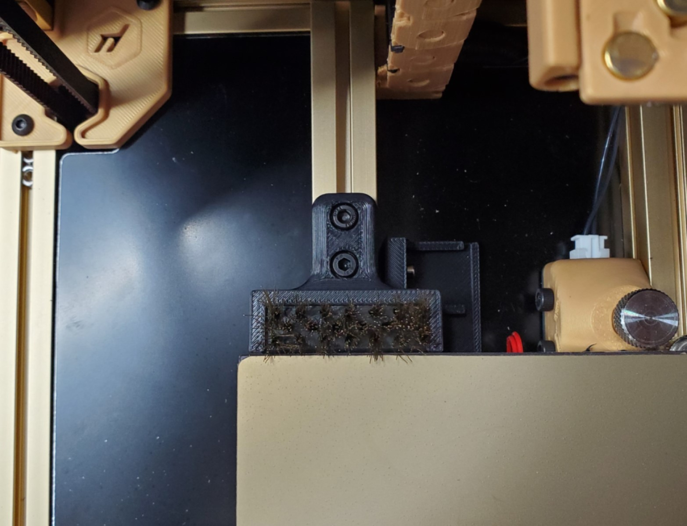
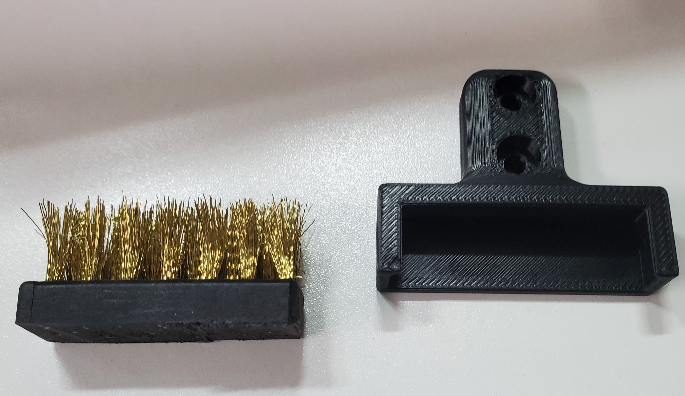

Nozzle Brush mount inspired by the [Decontaminator Purge Bucket & Nozzle Scrubber by edwardyeeks](https://github.com/VoronDesign/VoronUsers/tree/master/printer_mods/edwardyeeks/Decontaminator_Purge_Bucket_%26_Nozzle_Scrubber) 

Bed extrusions must be in V2 style orientation.

Common brush cut down to size.  Nylon should be ground to approx 6mm thick and ~36mm wide

Macro is a modified version of the Decontaminator macro.
