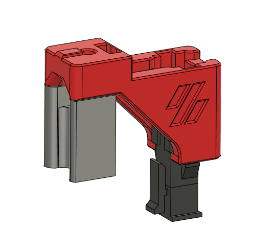
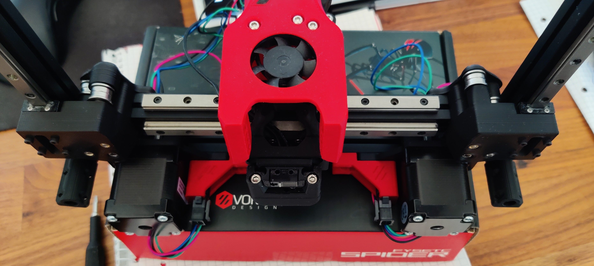

Description
-----------

This mod is based upon Ramas V2 Mod [AB_Plug_Microfit](https://github.com/Ramalama2/Voron-2-Mods/tree/main/AB_Plug_Microfit). It provides a slot to mount one Molex Micro-Fit 3.0 2x2 Plug to easily mount motors without built-in connectors.

BOM
---
|                  Name                 	| Amount required 	|
|:-------------------------------------:	|:---------------:	|
| AB_Connector_Plug_Micron_Microfit.stl 	|        2        	|
| [Plug Housing](https://www.molex.com/molex/products/part-detail/crimp_housings/0430200400)                        	|        2        	|
| [Receptacle Housing](https://www.molex.com/molex/products/part-detail/crimp_housings/0430250400)                   	|        2        	|
| [Male Crimp](https://www.molex.com/molex/products/part-detail/crimp_terminals/0430310001)                           	|        8        	|
| [Female Crimp](https://www.molex.com/molex/products/part-detail/crimp_terminals/0430300001)                         	|        8        	|
| BHCS M3x6                             	|        2        	|
| M3 nut                                	|        2        	|
| Zip ties                                	|        2        	|

