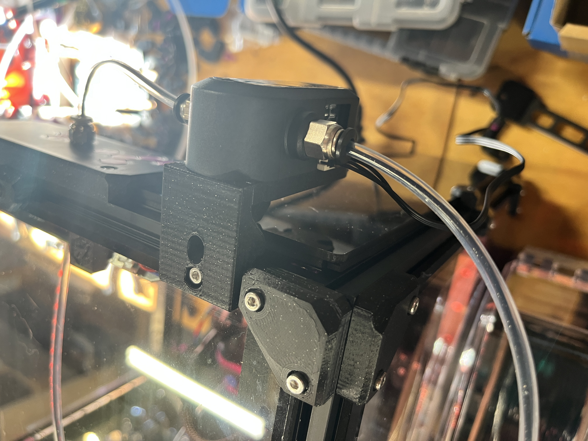

# 1515 BTT SFS Mount

This is a mount based off of the Micron Bowden Tube Holder and is intended to be used in place of one. Install an M3 heatset insert in the printed bcakplate and replace the SFS backplate with the printed part using using the same screws. The SFS is secured to the bracket with a 20mm long screw. 

