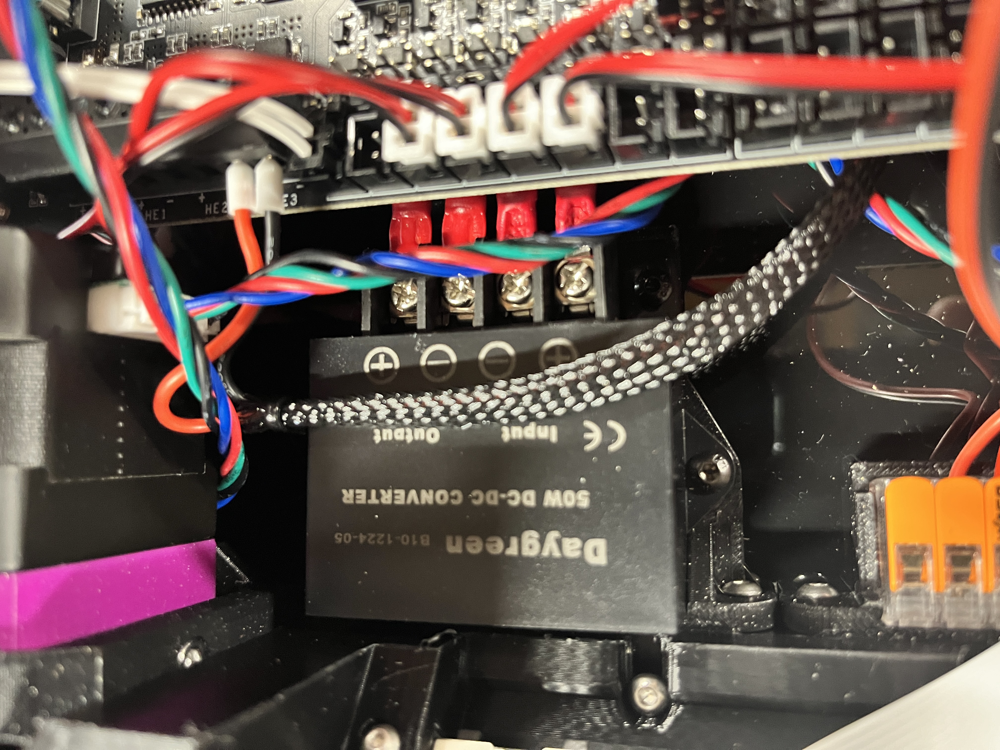

# 1515 Daygreen 5VDC Regulator Mount

This is a mount based off of the 1515 WAGO mount to secure a Daygreen 5VDC Voltage Regulator. Four heatset inserts are used in the mount to fasten the regulator. 

