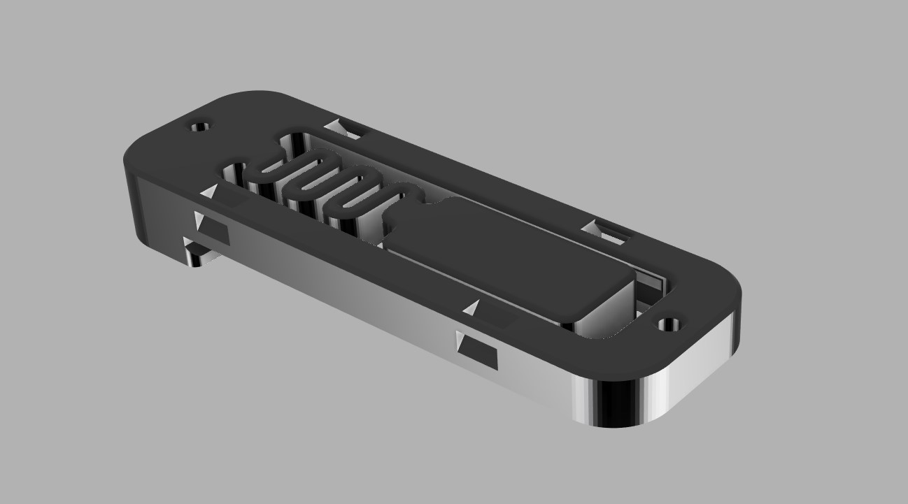
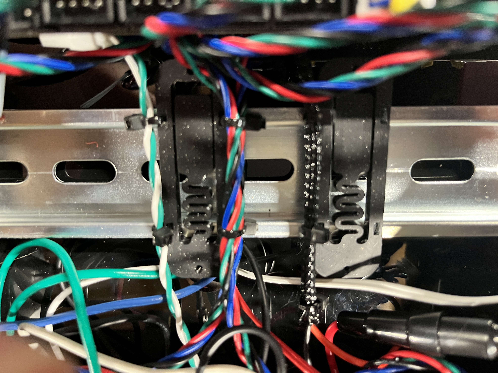

# Zip Tie and PCB Din Clip

This is a modifed PCB Din Clip to add slots for zip ties. This clip allows wire bundles to bed tied on either side and will fit under the PSU and Octopus Control Board. 

The PCB mount holes were retained for part commonality.  

