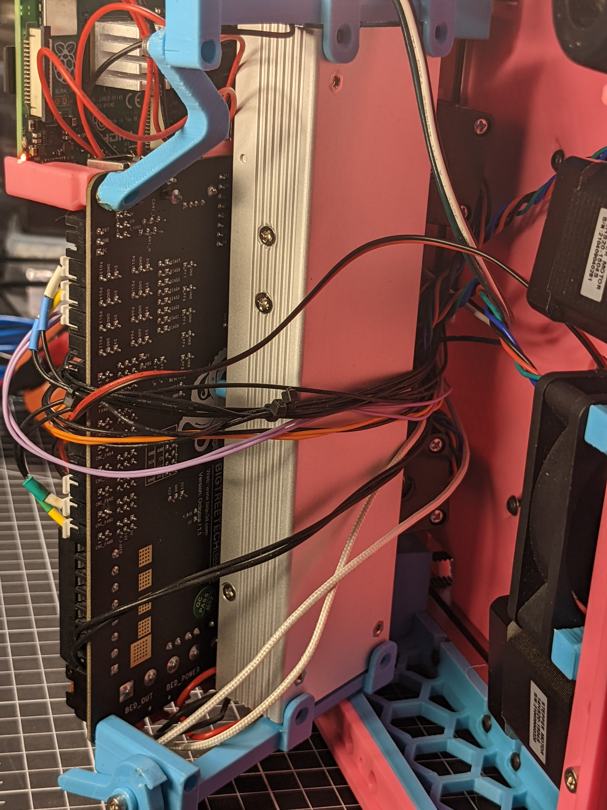
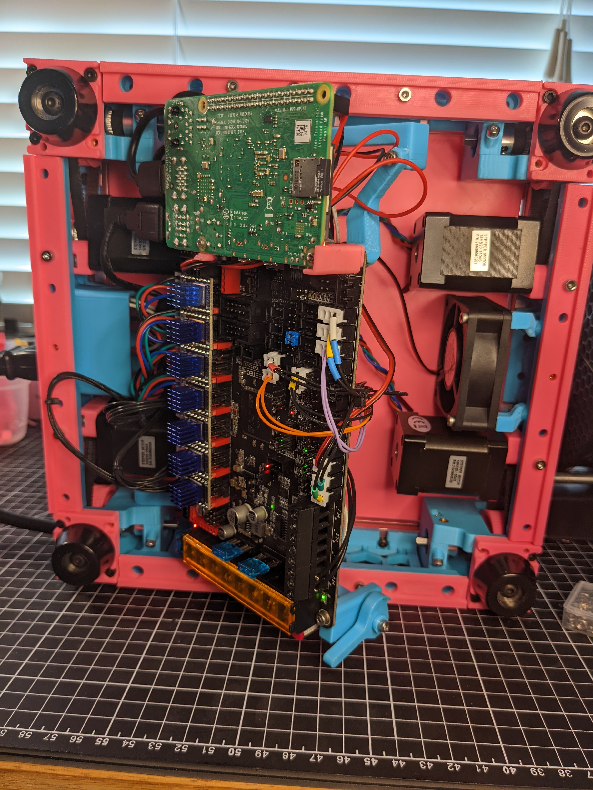
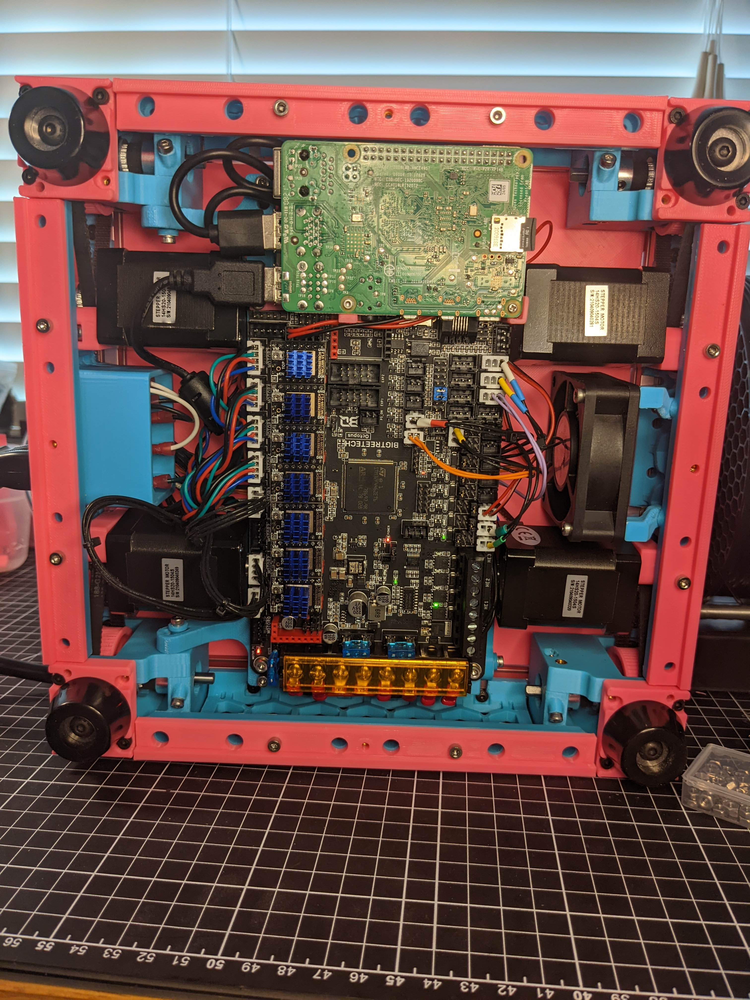
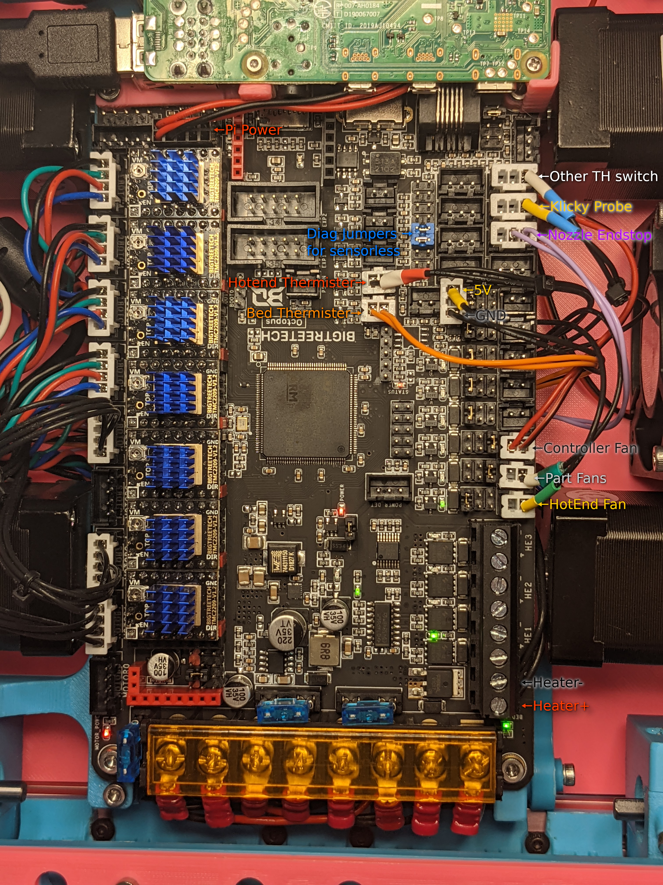
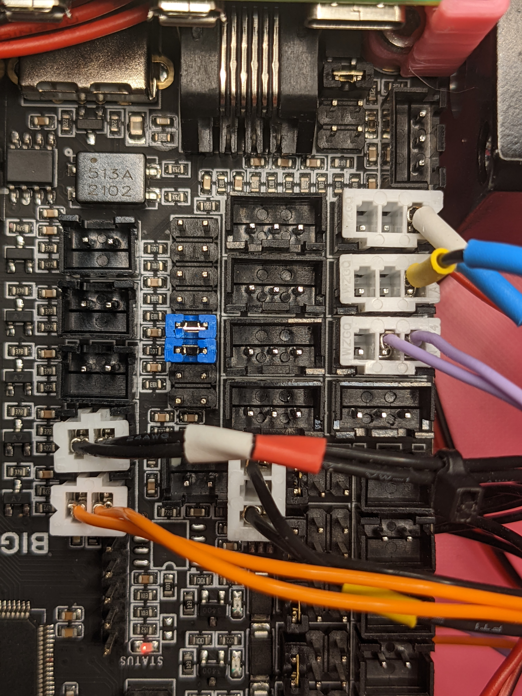
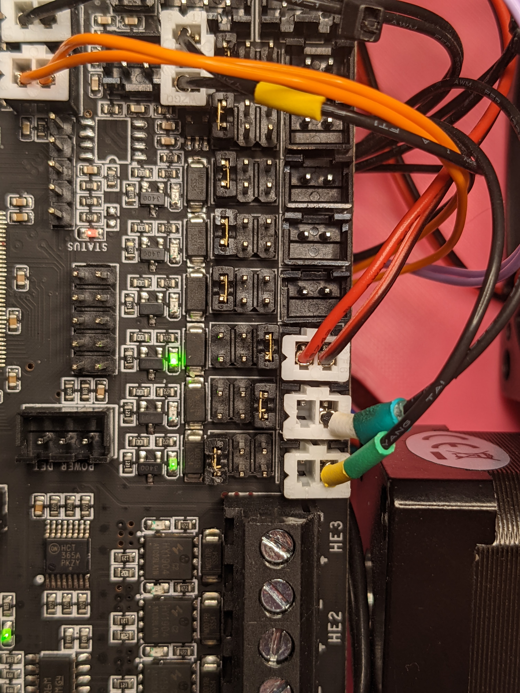
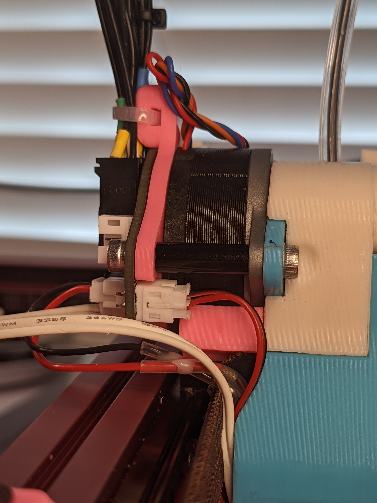
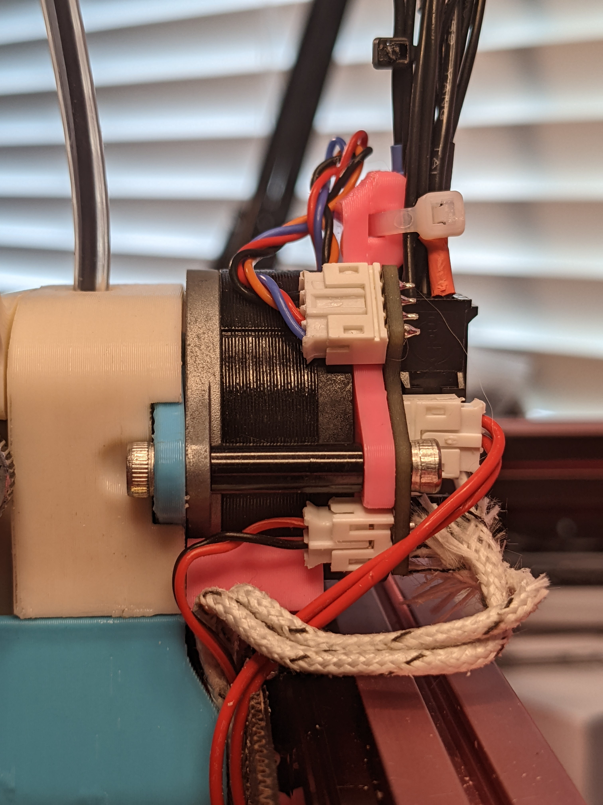
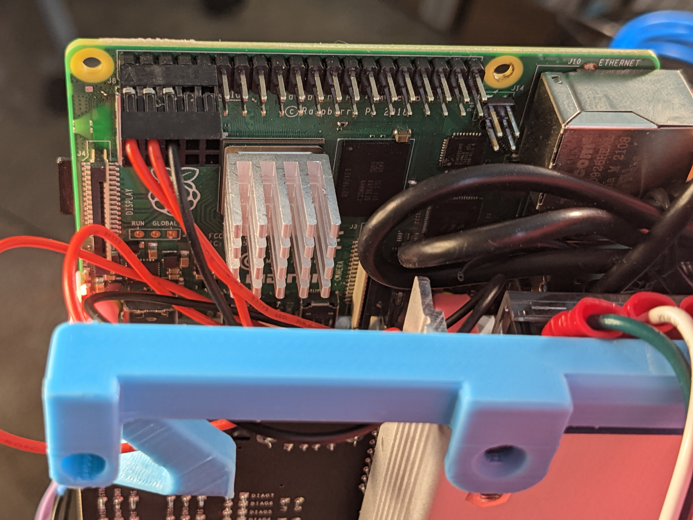

# Whats this??
This directory contains my Micron's configuration.

# Warning!!
It is UNSAFE to use this directly without modifying for your printer.
You MUST modify this config for YOUR printer's specifics before use, otherwise you could start your machine on fire, destroy it or things attached to it.

This is being provided expressly without any warranty of correctness, utility, or safety.

USE AT YOUR OWN RISK.

# Configs
Klipper configs are in the klipper_config directory.

# Wiring help!

Wires have been color-coded, so you can match what end goes where!

---
| Part | Image |
| ---  | ---   |
|  Micron Underside Wires|  |
|  Micron Underside Hinged Open|  |
|  Micron Underside Hinged Close|  |
|  Octopus overview |  |
|  Octopus Detail Endstop | 
|  Octopus Detail Fan| 
|  Pancake | 
|  Part Cooling Fan A| 
|  Part Cooling Fan B| 
|  Pi Power | 
