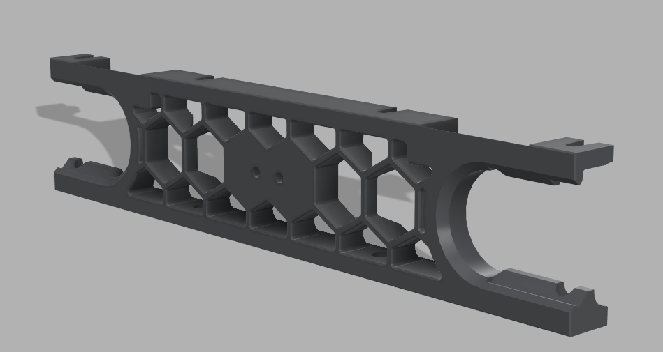
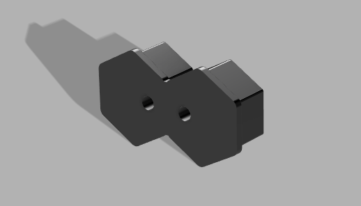

<h1>Micron+ mini12864 front skirt mounts</h1>

This mod provides 2 options for mounting a mini12864 display to your micron+

Both options use the standard display mount adapter found
[here](https://github.com/PrintersForAnts/Micron/blob/main/STLs/Electronics/120/display/display_mount.stl)

The STL files for the housing can be found
[here](https://github.com/PrintersForAnts/Micron/tree/main/STLs/Electronics/120/display/Mini-12864)

<h2>Option 1</h2>

Option 1 is to print a whole front skirt for your micron with the centre 2 hexagons filled in and the 2 required mounting holes, The STL for which can be found [here](<https://github.com/PrintersForAnts/Micron/blob/main/Mods/Shix/MicronPlus mini12864 front skirt mount/STL/180_front_skirt_x1_display.stl>)

<h2>Option 2</h2>

Option 2 is to print a small insert that fits in to your existing front skirt again with the 2 required mounting holes, The STL for this option can be found [here](<https://github.com/PrintersForAnts/Micron/blob/main/Mods/Shix/MicronPlus mini12864 front skirt mount/STL/SkirtInsert.stl>)

