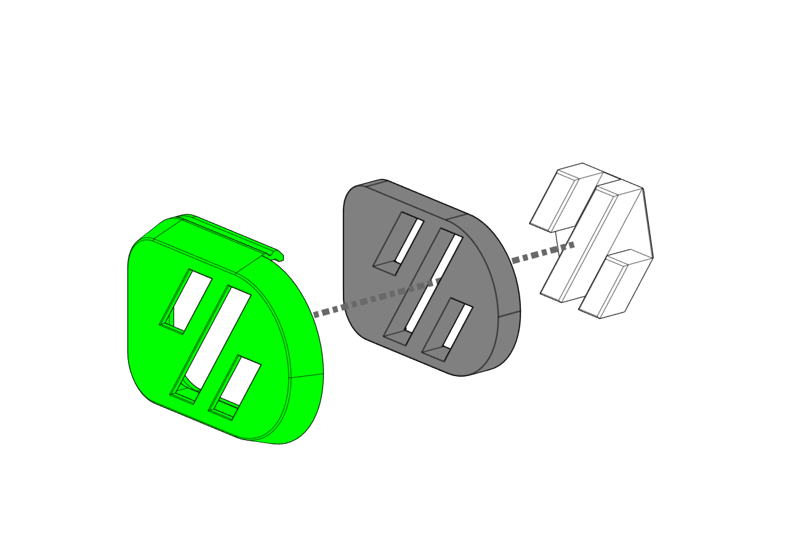
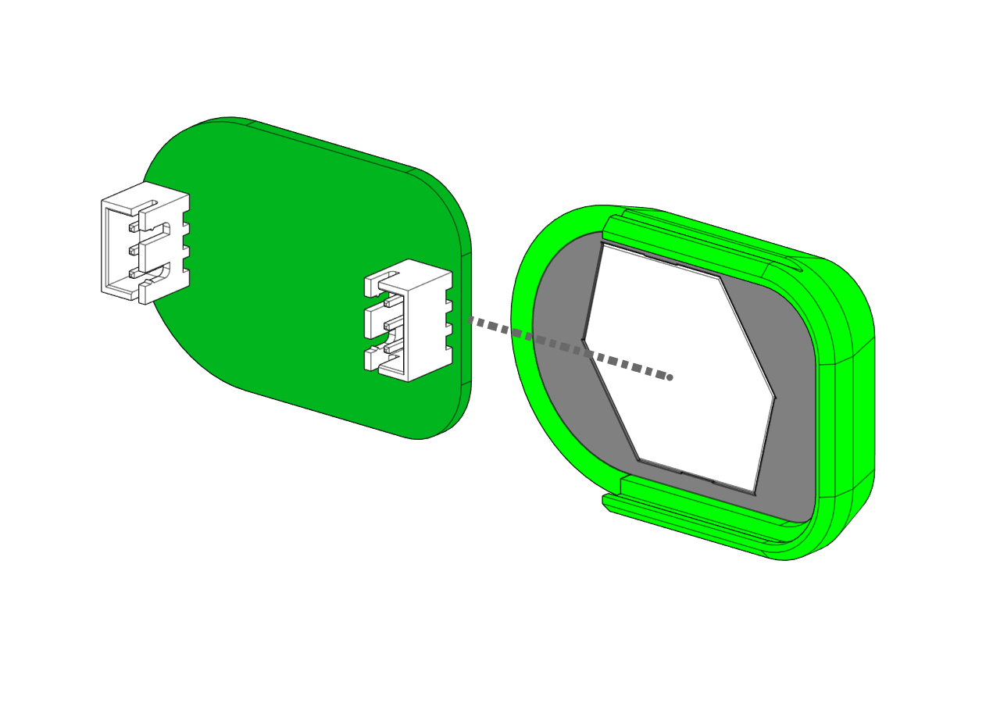
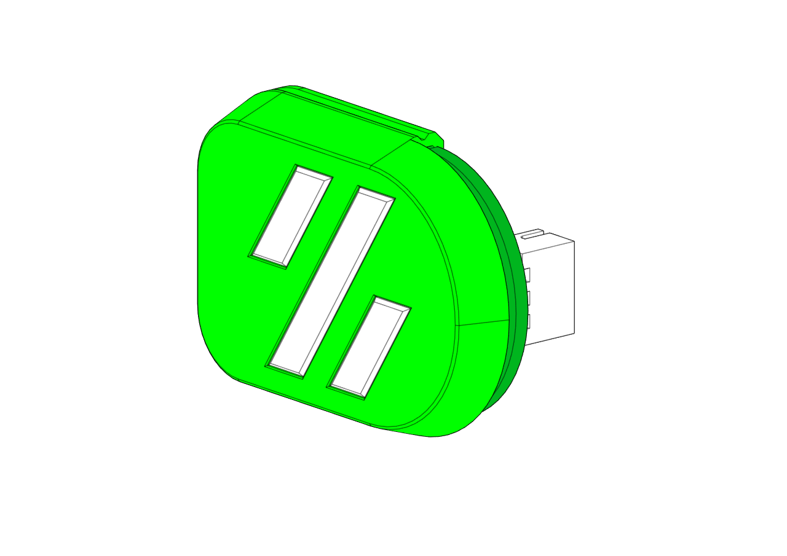

# Micron Skirt LEDs #

# Disclaimer #
 This is baby's first PCB.  I have no clue what I'm doing, and take no responsibility if things go pear shaped.  That being said, the KiCad is all in the KiCad folder, along with a zip of the Gerbers that you'd drop onto JLCPCB to make an order.  
 
 Also they're made with the WS2812B-V5 in mind.  These have the decoupling capacitors built in.  If you use the standard issue, probably it'll be fine, maybe a light glitches every now and again, or maybe the first in the chain dies sooner.  Dunno.  As stated above, I have no idea what I'm doing.  `Lab_in_a_lab_coat.jpg`.

Insert the Diffuser and Light blocker into the main body

Slide the PCB in the grooves along the edge

# Sample Config # 
This assumes you're using the optional pass-through to chain from one board into the second.

    [neopixel Skirt_LEDs]
    pin:RGB_PIN
    chain_count: 16
    color_order: GRB
    initial_RED:0.6
    initial_GREEN: 0.6
    initial_BLUE: 0.6
