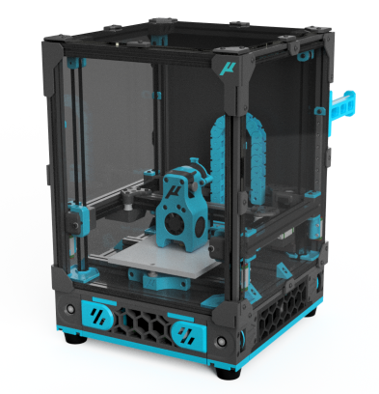

## Micron

[BOM](https://docs.google.com/spreadsheets/d/1caKSc-EukVpRgN67_by_hdzVPlExSRQ66j3OXlEmcCU/edit#gid=0)

### Frame Extrusions
Misumi Part #  |Qty | Notes
 ----|----|----|
HFS3-1515-300 |4 | Blind holes need to be drilled
HFS3-1515-220 |10| Ends need to be tapped (M3)
HFS3-1515-205 |2 |
HFS3-1515-190 |1 |
HFS3-1515-125 |1 |

Thanks to the following people on discord who have helped get this printer finished 

@TheWarolf#1247

@L.e.o.p.a.r.d#0990

@deepfriedheroin#5006

@JosAr#0517

@sentein#3903

@madcat#7838

@Kyrios#5486

@faithblinded#1491

@zruncho#1790

@Finn#2449

if you wanna help support the project you can [here](https://www.patreon.com/user?u=27661824&fan_landing=true)

