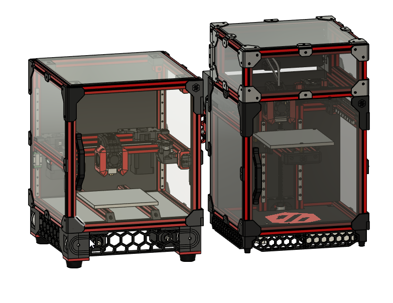

## Micron2.4

## Design Prompt: Build a V2, using v0 Components
Why? Why not.
Actual reasons:

- Fun way to screw around and make a V0 more interesting
- Better Z and bed leveling: self-leveling, no leadscrews to wobble or source, and avoids cantilevered bed
mounting
- Cheap way to see what a V2 is like from a software side

## Design goals
- Use as much V0.1 stuff as possible:
- Toolhead (extruder + hotend): V0.1 Mini-AB
- XY Drive: F623ZZ bearings, GT2 belt, 20t pulleys, NEMA14 motors
- Motion: MGN7H 150mm rails and carriages
- Frame: something like 200mm 1515 (see below)
- Bed: 120x120
- Use as much V2.4 (scaled-down) as possible:

- Zruncho: Printability on a v0 should be a bonus but ideally not required. It just makes things more
complicated if you have to split stuff up.
- Exist quickly and be fun to build

## Expected additional BOM costs (~100 only)
- 2x additional 150mm rails and carriages
- 3x extra motor drivers + a board to handle them
- 12x pulleys (3 for each z drive) + 4 belts
