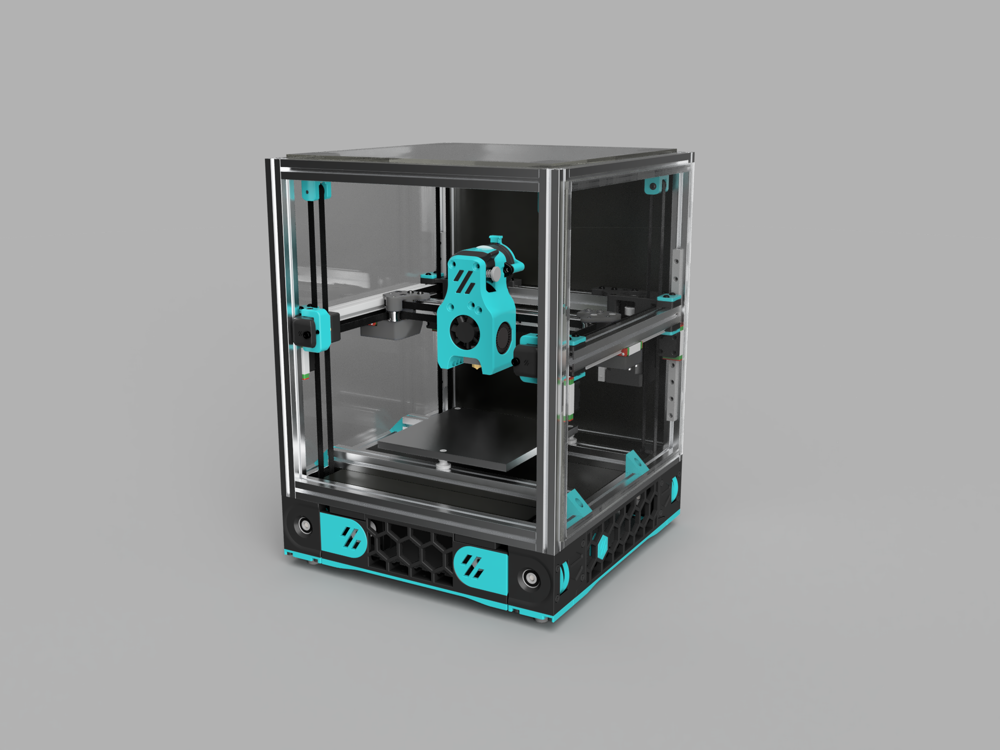

## miniv2 (name change pending)

[INCOMPLETE BOM](https://docs.google.com/spreadsheets/d/1caKSc-EukVpRgN67_by_hdzVPlExSRQ66j3OXlEmcCU/edit#gid=0)
## Design Prompt: Build a V2, using v0 Components
Why? Why not.
Actual reasons:

- Fun way to screw around and make a V0 more interesting
- Better Z and bed leveling: self-leveling, no leadscrews to wobble or source, and avoids cantilevered bed
mounting
- Cheap way to see what a V2 is like from a software side

## Design goals
- Use as much V0.1 stuff as possible:
- Toolhead (extruder + hotend): V0.1 Mini-AB
- XY Drive: F623 bearings, GT2 belt, 16T pulleys, NEMA14 motors
- Motion: MGN7H 150mm rails for Z and Y with MGN9C 150mm for X 
- Bed: 120x120
- Z drives - geared down 4:1 using GT2 16T and GT2 64T either form Powge or the printed version from the Voron Jetpack extruder for the belted Z to run the gantry 
- Use as much V2.4 (scaled-down) as possible
- utilize the [Euclid mag probe](https://github.com/nionio6915/Euclid_Probe) for QGL or a more DIY version of the a mag probe

### Frame Extrusions
Misumi Part #  |Qty | Notes
 ----|----|----|
HFS3-1515-300 |4 | Blind holes need to be drilled
HFS3-1515-220 |10| Ends need to be tapped (M3)
HFS3-1515-205 |2 |
HFS3-1515-190 |1 |
HFS3-1515-125 |1 |

