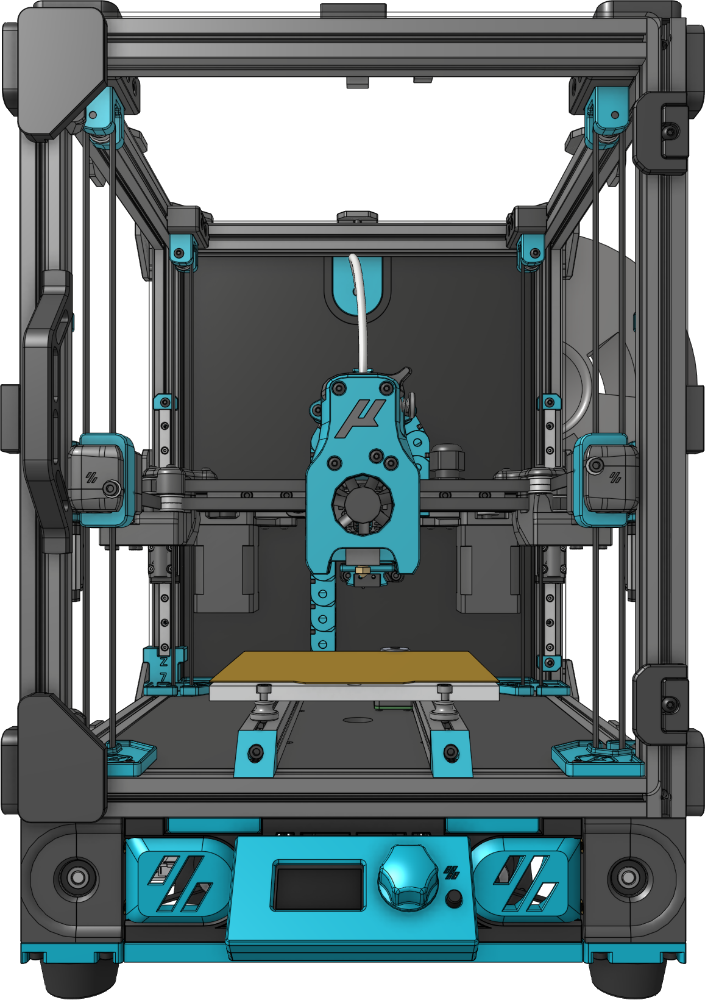

## Micron

[The official Micron BOM is here.](https://docs.google.com/spreadsheets/d/1caKSc-EukVpRgN67_by_hdzVPlExSRQ66j3OXlEmcCU)

If you want to purchase full kits there are 2 available 

<a href="https://deepfriedhero.in/products/micron-kit?aff=3" rel="nofollow">DFH Kit (Affiliate Link)</a>

<a href="https://s.click.aliexpress.com/e/_AXb37b" rel="nofollow">Funssor Kit (Affiliate Link)</a>

    

    Frame Extrusions
    

Misumi Part #  |Qty | Notes
 ----|----|----|
HFS3-1515-300 |4 | Blind holes need to be drilled
HFS3-1515-220 |10| Ends need to be tapped (M3)
HFS3-1515-205 |2 |
HFS3-1515-190 |1 |
HFS3-1515-125 |1 |

    

    Linear Rails
    

Part  | Qty | Length
-----|----|-----|
MGN7H | 6 | 150mm
MGN9C | 1 | 150mm

Thanks to the following people on Discord who have helped get this printer finished:

- @TheWarolf#1247
- @L.e.o.p.a.r.d#0990
- @deepfriedheroin#5006
- @JosAr#0517
- @sentein#3903
- @madcat#7838
- @Kyrios#5486
- @faithblinded#1491
- @zruncho#1790
- @Finn#2449
- @clee#1337
- @slidr#4412

[You can support the Micron project on Patreon](https://www.patreon.com/user?u=27661824&fan_landing=true).

[Based on the Voron Design 2.4](https://github.com/VoronDesign/Voron-2)
